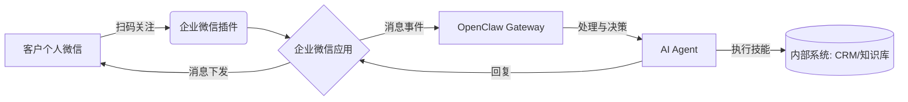

# OpenClaw企业微信：自动销售接待解决方案

## 一、方案核心价值

将OpenClaw与企业微信结合，可构建一个**7×24小时在线、具备初步销售能力、可无缝转接人工**的智能接待机器人。其核心价值在于：
*   **效率提升**：自动处理80%的重复性初步咨询（如产品介绍、价格询问、资质查询）。
*   **线索标准化**：自动收集并结构化客户信息（公司、需求、联系方式），直接录入CRM。
*   **永不掉线**：突破人工客服的工作时间限制，抓住每一个潜在商机。
*   **成本优化**：降低初级销售或客服的人力投入，让团队聚焦于高价值转化环节。
*   **数据可控**：所有交互数据留存于自托管环境，保障客户隐私与商业机密。

## 二、自动销售接待的核心功能场景

基于OpenClaw的能力，可实现以下自动化流程：

1.  **智能欢迎与分流**
    *   **场景**：客户添加企微好友或进入群聊后，自动发送欢迎语，并引导客户选择问题类型（如“产品咨询”、“报价申请”、“技术支持”）。
    *   **OpenClaw实现**：通过`dmPolicy`和`groupChat`配置自动响应，利用LLM理解用户意图并调用预设流程。

2.  **产品/服务问答与资料推送**
    *   **场景**：客户询问产品特性、价格、案例、资质文件时，AI自动从知识库中检索准确信息，并以图文、文件形式发送。
    *   **OpenClaw实现**：结合**技能系统**，集成内部知识库、产品数据库、文件系统，实现精准信息查询与推送。

3.  **初步需求收集与线索生成**
    *   **场景**：通过多轮对话，自动询问并记录客户的公司规模、预算、核心需求、时间计划等信息。
    *   **OpenClaw实现**：利用**记忆系统**在会话中持续记录客户信息，并通过技能调用API，将结构化的线索数据自动写入CRM系统（如Salesforce、纷享销客、自建系统）。

4.  **自动预约与任务创建**
    *   **场景**：当客户需要深度沟通时，AI可展示销售人员的空闲时段，引导客户选择，并自动在日历中创建会议邀请、向销售同事发送任务通知。
    *   **OpenClaw实现**：通过技能集成日历服务（如Google Calendar、飞书日历）、企微内部消息API，实现自动化调度。

5.  **复杂问题升级与人工转接**
    *   **场景**：当AI判断问题超出处理范围（如复杂定制需求、投诉）或客户明确要求时，自动@或私聊指定销售人员，并将会话上下文（记忆）同步给人工。
    *   **OpenClaw实现**：利用**多代理系统**或**工具调用**，触发通知技能，将包含完整对话摘要的消息发送给人工坐席。

## 三、技术实现路径

### 1. 基础架构：企业微信接入OpenClaw
采用文档推荐的 **“企业微信中转”** 方案，这是唯一合规、稳定的生产级路径。

**流程示意（按消息走向）：**

| 步骤 | 环节 | 说明 |
|------|------|------|
| 1 | 客户个人微信 | 用户扫码关注 |
| 2 | 企业微信插件 | 触达企业侧 |
| 3 | 企业微信应用 | 接收/下发消息 |
| 4 | OpenClaw Gateway | 接收消息事件，统一入口 |
| 5 | AI Agent | 处理与决策 |
| 6 | 内部系统（CRM/知识库） | AI 通过技能执行查询、写入等 |
| 7 | 企业微信应用 ← AI | 回复内容下发 |
| 8 | 客户个人微信 | 收到 AI 回复 |

**简化流程链：**  
客户微信 → 扫码关注 → 企业微信插件 → 企业微信应用 →（消息事件）→ OpenClaw Gateway → AI Agent →（执行技能）→ 内部系统 /（回复）→ 企业微信应用 → 消息下发 → 客户微信。

（若站点支持 Mermaid，下方代码块将显示为流程图。）

### 2. 关键配置步骤（基于文档）
*   **Step 1: 准备企业微信**
    1.  注册企业微信（无需认证）。
    2.  在管理后台创建**自建应用**，获取`AgentId`和`Secret`。
    3.  配置应用的“接收消息”模式，建议使用**API接收**（需公网服务器）。

*   **Step 2: 部署与配置OpenClaw**
    1.  在**具有公网IP的云服务器**上部署OpenClaw（推荐使用阿里云、腾讯云的一键部署镜像）。
    2.  安装企业微信社区插件（如 `dingxiang-me/OpenClaw-Wechat`）。
    3.  在 `openclaw.yaml/json` 中配置企业微信通道，填入`AgentId`、`Secret`、服务器公网地址及回调Token。

*   **Step 3: 开发销售接待技能**
    1.  在OpenClaw工作区创建 `skills/sales_bot/` 目录。
    2.  编写 `SKILL.md`，定义技能元数据、工具（如 `query_product_db`, `create_crm_lead`, `assign_to_sales`）。
    3.  实现对应的工具函数，连接您的内部系统API。
    4.  精心设计Agent的 `SOUL.md` 和 `USER.md`，塑造其专业、热情的“销售助理”人格。

### 3. 核心OpenClaw功能应用
*   **记忆系统**：利用 `MEMORY.md` 和向量检索，让AI记住同一客户的多次咨询历史，提供连贯服务。
*   **技能编排**：将产品查询、报价计算、线索创建等动作封装为技能，由AI根据对话动态调用。
*   **会话隔离**：通过 `dmScope` 配置，确保不同客户的对话上下文独立，避免信息混淆。
*   **成本控制**：在模型配置中设置 `fallbacks` 到低成本模型，并务必在云厂商处设置**API消费额度告警**。

## 四、实施路线图与避坑指南

### 第一阶段：MVP验证（1-2周）
1.  **目标**：实现基础问答与线索收集。
2.  **动作**：
    *   完成企微与OpenClaw的基础对接。
    *   构建包含5-10个核心Q&A的产品知识库。
    *   开发一个简单的“收集客户信息”技能，将数据写入在线表格。
3.  **验证指标**：自动回复准确率 >85%，线索信息完整度 >90%。

### 第二阶段：流程自动化（2-4周）
1.  **目标**：实现预约与内部协同。
2.  **动作**：
    *   集成公司日历系统。
    *   开发“创建销售任务”技能，与企微内部消息打通。
    *   设置复杂问题转人工规则。
3.  **验证指标**：自动预约成功率、人工转接平滑度。

### 第三阶段：优化与扩展（持续）
1.  **目标**：提升转化率与扩展场景。
2.  **动作**：
    *   基于对话数据分析优化Prompt和技能逻辑。
    *   接入更多数据源（如订单系统、客服工单）。
    *   探索与电话、邮件的多渠道协同。

### ⚠️ 关键风险与避坑指南
1.  **成本失控**：**务必设置硬性API消费限额**。OpenClaw的多轮思考消耗Token极快，需从第一天就监控成本。
2.  **安全漏洞**：
    *   始终使用**最新版本**的OpenClaw，修复已知RCE漏洞。
    *   严格审查并测试第三方技能，防止供应链攻击。
    *   为OpenClaw配置独立的服务器或Docker沙箱，**切勿在拥有核心业务数据的主机上直接运行**。
3.  **过度承诺**：明确告知客户正在与AI对话，并设置清晰的边界，对于无法处理的问题应快速、友好地引导至人工。
4.  **数据隐私**：在`SOUL.md`和系统Prompt中强化隐私保护指令，确保AI不会泄露训练数据或其他客户信息。
5.  **运维保障**：确保云服务器稳定，设置Gateway进程的监控和自动重启机制。

## 五、结论

OpenClaw + 企业微信是构建**自动化、智能化销售前台**的强大组合。它不仅能承接流量、筛选线索，更能通过持续的交互和数据沉淀，成为销售团队的“智能协作者”。成功的关键在于：**采用合规的企微接入方案、聚焦MVP快速验证、严格防范成本与安全风险、并围绕真实的销售流程进行精心设计。**

**建议启动步骤**：
1.  申请一个企业微信测试号。
2.  在腾讯云或阿里云购买一台轻量应用服务器（选择OpenClaw预装镜像）。
3.  按照文档“第五部分：微信接入OpenClaw”完成基础对接。
4.  从一个最简单的产品问答技能开始，快速跑通闭环。